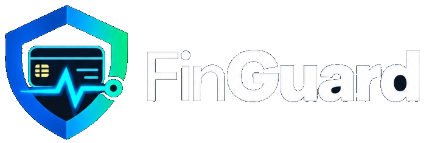
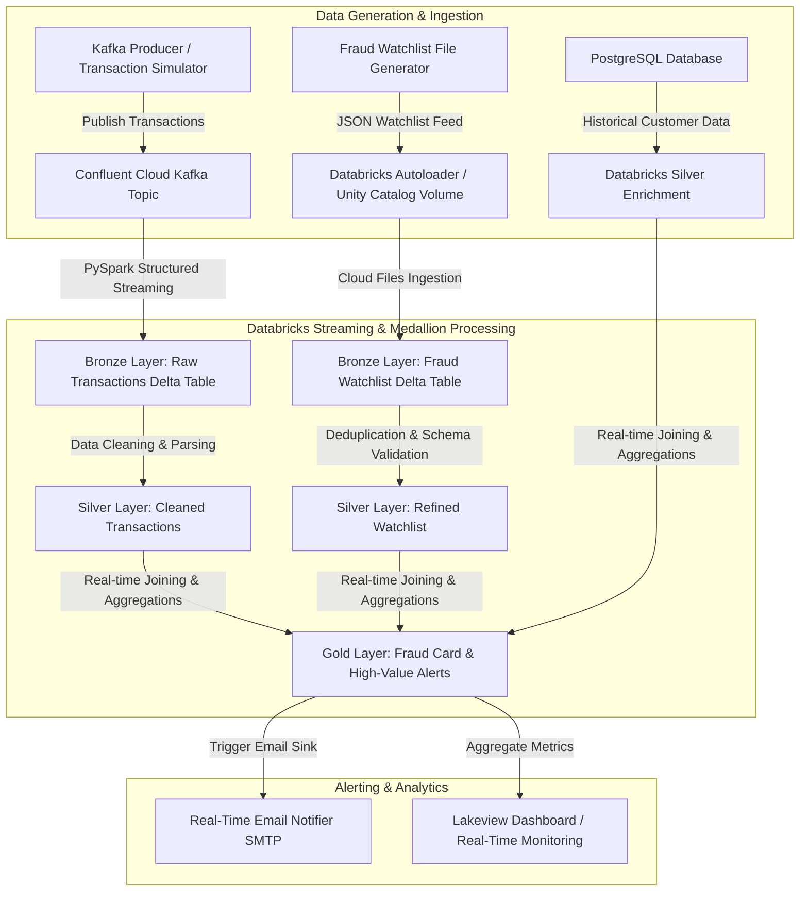

# FinGuard: Real-Time Credit Card Fraud Detection System

<p align="center">
  
</p>

[](https://finguard.isthatabbhi.tech)

[](https://www.python.org/)
[](https://confluent.io/)
[](https://databricks.com/)
[](https://www.postgresql.org/)
[-00A86B?style=flat)](#architecture)

**Live Showcase Platform:** [https://finguard.isthatabbhi.tech](https://finguard.isthatabbhi.tech)

An enterprise-grade, end-to-end Real-Time Credit Card Fraud Detection and Streaming Analytics System. This system simulates live high-frequency financial transactions, streams them through Apache Kafka (Confluent Cloud), ingests and processes them via Databricks Structured Streaming & Delta Lake (Medallion Architecture), enforces real-time fraud rules and watchlist matching, triggers automated email notifications for suspicious activity, and visualizes insights on an interactive Lakeview Dashboard.

---

## Architecture Overview



---

## Key Features

- **High-Frequency Transaction Simulation**: Simulates realistic customer spending patterns, merchant distributions, velocity checks, and configurable fraud anomalies in real time.
- **Medallion Delta Lake Architecture**:
  - **Bronze Layer**: Raw payload ingestion from Kafka streams and Autoloader feeds with exact timestamping.
  - **Silver Layer**: Data cleansing, schema enforcement, dynamic type casting, and deduplication.
  - **Gold Layer**: High-value transaction thresholds, watchlist matching, sliding-window transaction counts, and alerting triggers.
- **Automated Real-Time Alerting**: Immediate SMTP email notification system dispatching alerts for suspicious transactions and flagged watchlist cards.
- **Historical Data Sync**: Integrates historical customer profile snapshots from PostgreSQL for identity enrichment.
- **Executive Dashboard**: Pre-configured Databricks Lakeview dashboard JSON providing visibility into fraud counts, alert breakdown, velocity spikes, and financial risk metrics.

---

## Repository Structure

```text
.
+-- dashboard/
|   +-- app.py
|   +-- deploy_streamlit.md
|   +-- requirements.txt
|   \-- FinGuard Fraud Detection Monitoring.lvdash.json
|
+-- kafka_producer/
|   +-- config.py
|   +-- producer_normal.py
|   +-- producer_fraud_card.py
|   +-- producer_fraud_transaction.py
|   +-- customer_generator.py
|   +-- merchant_generator.py
|   +-- transaction_generator.py
|   +-- fraud_engine.py
|   +-- .env.example
|   \-- requirements.txt
|
+-- databricks notebooks and pipelines/
|   \-- finguard_project/
|       +-- 01_kafka_streaming_test.py
|       +-- 02_Setup_Secret_Scope.py
|       +-- 03_Send_Email.py
|       +-- 04_Autoloader_test.py
|       +-- finguard_streaming/
|       |   +-- bronze/
|       |   +-- silver/
|       |   +-- gold/
|       |   \-- alert/
|       +-- finguard_customers_silver_ingestion/
|       \-- fraud_watchlist_file_generator/
|
+-- postgres sql/
|   +-- setup_neon_postgres.py
|   +-- customers_historic.sql
|   \-- customers_incremental.sql
|
+-- deploy_to_databricks.py
+-- .gitignore
\-- README.md
```

---

## Tech Stack

- **Streaming Broker**: Apache Kafka (Confluent Cloud SASL/PLAIN)
- **Processing Engine**: PySpark, Databricks Delta Live Tables / Structured Streaming
- **Storage Layer**: Databricks Delta Lake, Unity Catalog Volumes
- **Database**: PostgreSQL
- **Language**: Python 3.9+, SQL
- **Notification**: Python smtplib / MIME HTML Engine

---

## Setup & Execution Guide

### 1. Kafka Producer Setup

1. Navigate to the `kafka_producer` folder:
   ```bash
   cd kafka_producer
   ```
2. Create and activate a Python virtual environment:
   ```bash
   python -m venv .venv
   # Windows PowerShell:
   .\.venv\Scripts\Activate.ps1
   # macOS/Linux:
   source .venv/bin/activate
   ```
3. Install dependencies:
   ```bash
   pip install -r requirements.txt
   ```
4. Copy `.env.example` to `.env` and enter your Confluent Cloud Kafka credentials:
   ```bash
   cp .env.example .env
   ```
5. Start generating live transactions:
   ```bash
   python producer_normal.py
   ```

### 2. Live Interactive Demo Dashboard (Interview Presentation)

Run the real-time operational dashboard locally or deploy it to Streamlit Community Cloud (free forever, public URL, no credit card required):

```bash
# Install dashboard requirements
pip install -r dashboard/requirements.txt

# Run the live dashboard locally
streamlit run dashboard/app.py
```
- **One-Click Fraud Injection**: Click `🚨 High-Value Fraud` or `🛑 Watchlist Fraud` in the sidebar to simulate streaming fraud events and watch the Medallion pipeline detect them in real-time.
- **Streamlit Cloud Deployment**: See [dashboard/deploy_streamlit.md](dashboard/deploy_streamlit.md) for 3-minute deployment instructions.

### 3. Neon PostgreSQL Setup (Customer Master Data)

Initialize and populate customer master data in your free [Neon.tech](https://neon.tech) PostgreSQL instance:

```bash
python "postgres sql/setup_neon_postgres.py" --connection-string "<your_neon_connection_string>"
```

### 4. Databricks Pipeline Configuration & Automation

You can configure your Databricks workspace automatically via the REST deployment script:

```bash
python deploy_to_databricks.py --host "https://<your-workspace-url>" --token "<your-access-token>"
```

Or manually:
1. Import the notebooks from `databricks notebooks and pipelines/finguard_project` into your Databricks workspace.
2. Run `02_Setup_Secret_Scope.py` to create the `finguard-scope` secret scope and store your Kafka & Email API credentials securely.
3. Attach and execute the streaming notebooks in `finguard_streaming/` to start the Bronze, Silver, and Gold Delta Lake pipelines.

---

## Proof of Work & Portfolio Highlights

This project demonstrates proficiency in:
- **Data Engineering**: Real-time event streaming, schema validation, structured streaming, and stateful aggregations.
- **Cloud Analytics Architecture**: Designing robust Medallion architecture (Bronze/Silver/Gold) on Databricks Delta Lake.
- **Security & Best Practices**: Decoupled secret management using Databricks Secret Scopes and environment variable isolation.
- **End-to-End Operationalization**: From raw synthetic event generation to automated operational alerting and executive reporting dashboards.

---

## License & Attribution
Developed as part of an Internship Project at J2D Technologies. Designed for educational, demonstration, and proof-of-work purposes.

